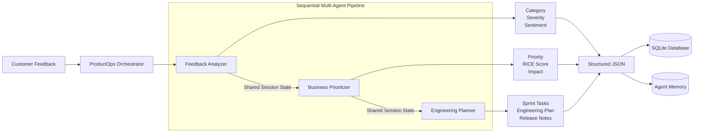
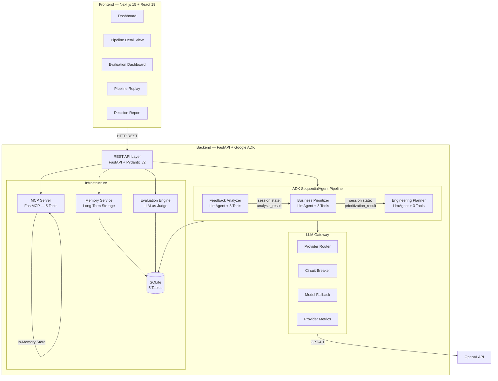
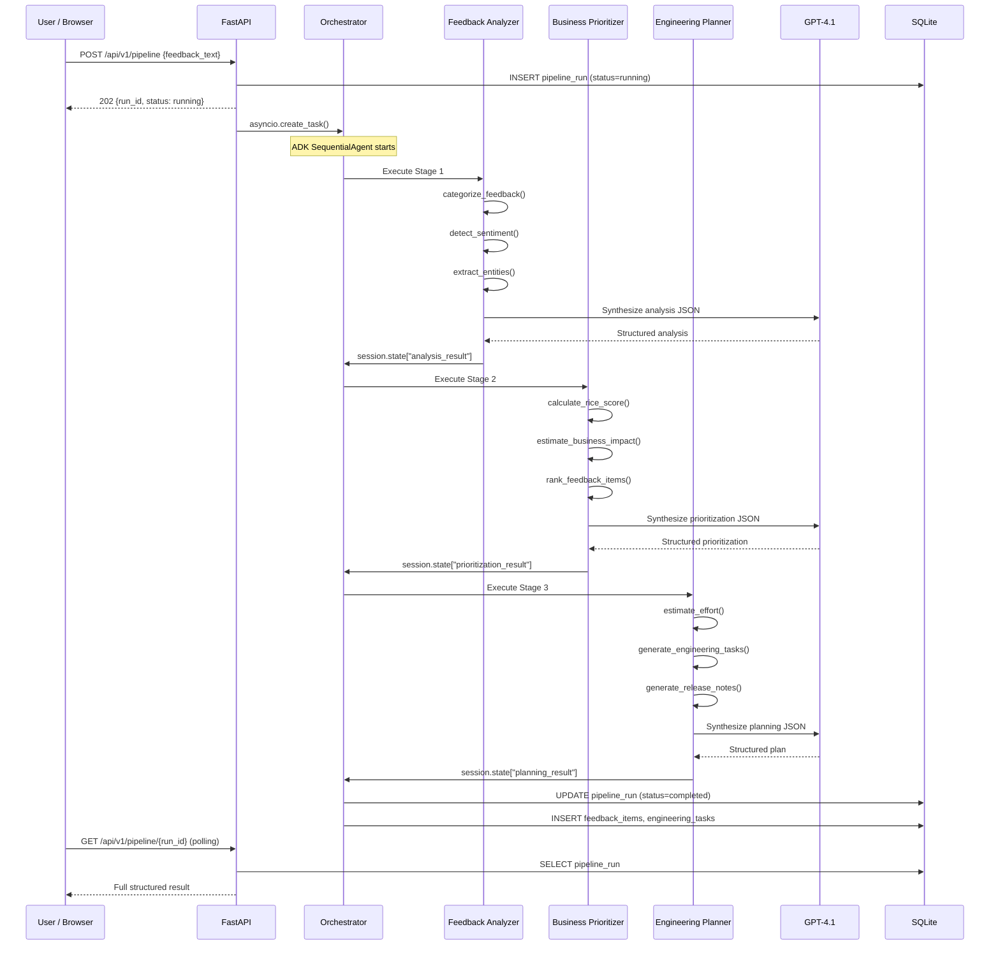
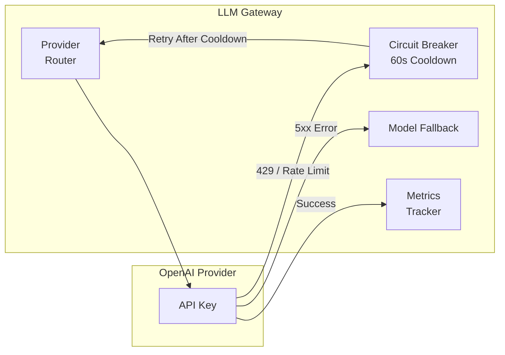
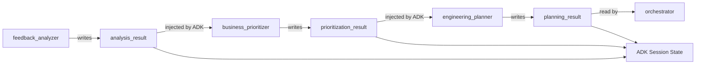
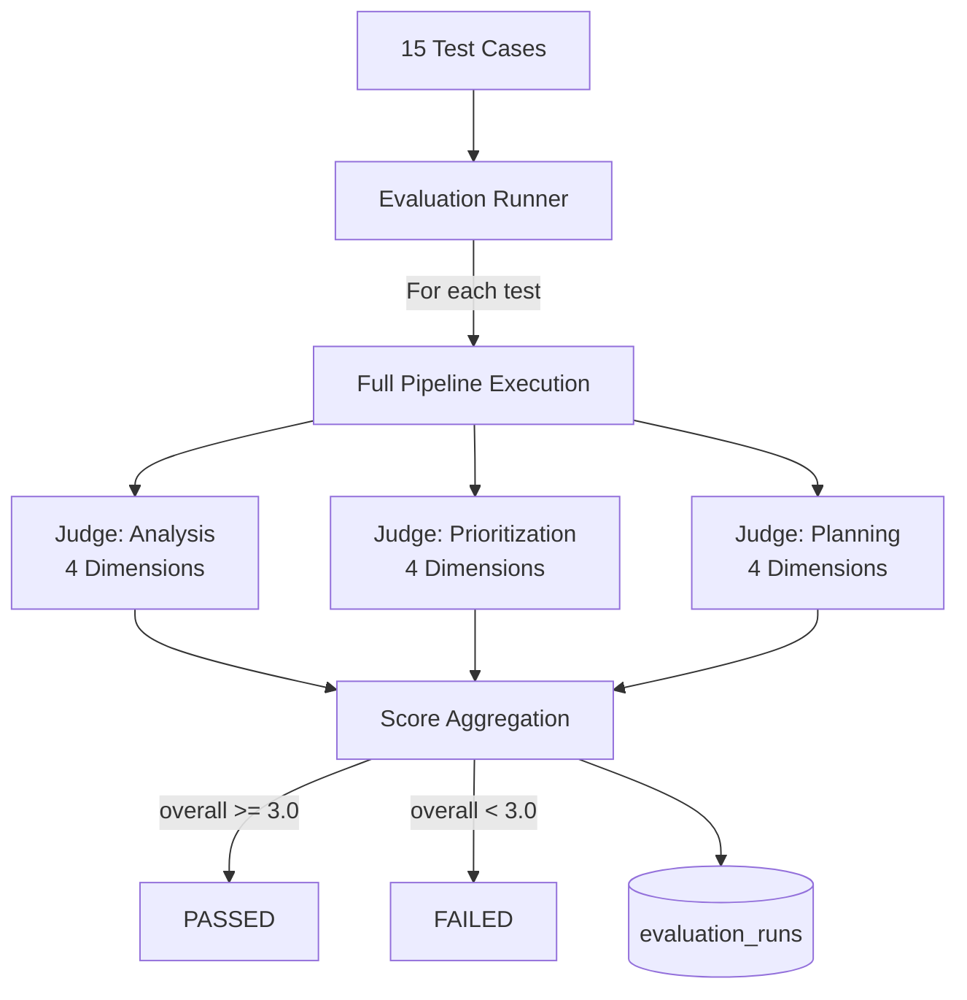
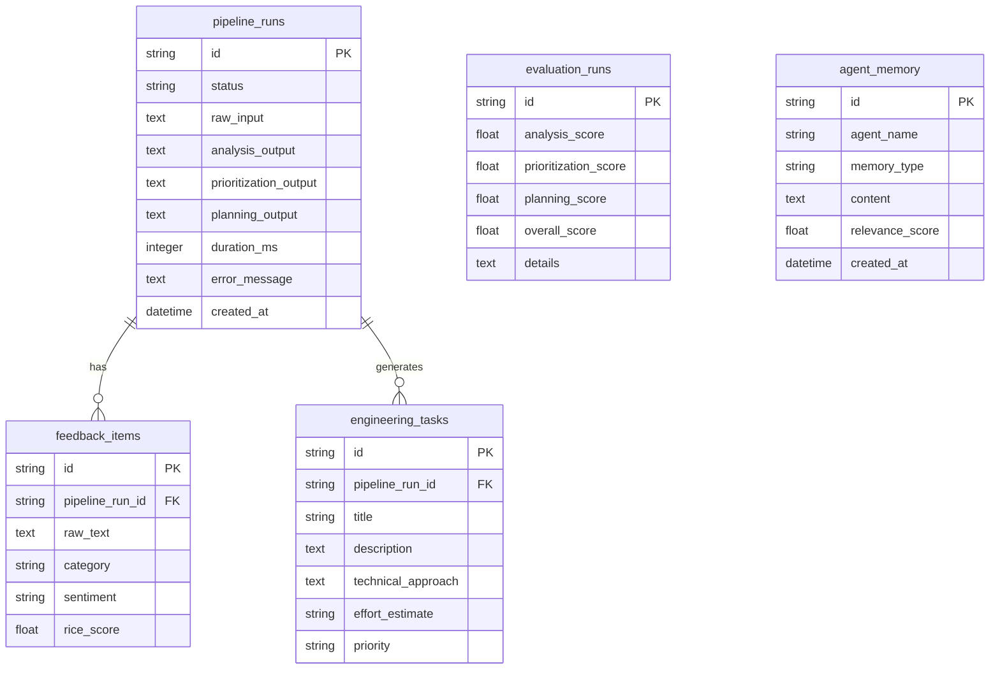

<div align="center">
  

  <h1>ProductOps AI</h1>

  <p><strong>Multi-Agent AI Pipeline for Automated Product Operations</strong></p>
  <p>Transforms raw customer feedback into prioritized, sprint-ready engineering tasks<br/>using a 3-agent orchestrated pipeline built on Google ADK, MCP, and LLM-as-Judge evaluation.</p>

  <p>
    <a href="#quick-start"></a>
    <a href="https://github.com/amitwaghmare888/productops-ai/commits/main"></a>
    
    
    
    
    
    
  </p>

  <p>
    <a href="#problem-statement">Problem</a> &nbsp;|&nbsp;
    <a href="#solution-overview">Solution</a> &nbsp;|&nbsp;
    <a href="#system-architecture">Architecture</a> &nbsp;|&nbsp;
    <a href="#adk-features-demonstrated">ADK Features</a> &nbsp;|&nbsp;
    <a href="#quick-start">Quick Start</a> &nbsp;|&nbsp;
    <a href="#api-reference">API</a> &nbsp;|&nbsp;
    <a href="#evaluation-framework">Evaluation</a>
  </p>
</div>

---

## Problem Statement

Product teams receive hundreds of customer feedback signals every week across multiple channels — app store reviews, support tickets, surveys, Slack messages, and internal reports. Converting this raw feedback into prioritized, actionable engineering work is a manual, inconsistent, and time-intensive process that depends on senior PM availability.

The typical workflow involves four bottlenecks:

1. **Triage** — Reading and categorizing each feedback item by type, sentiment, and severity
2. **Prioritization** — Applying a scoring framework (RICE, MoSCoW, or equivalent) to rank items by business impact
3. **Planning** — Converting prioritized items into engineering tasks with effort estimates, acceptance criteria, and sprint allocation
4. **Reporting** — Generating release notes and executive summaries for stakeholders

Each step requires domain expertise, introduces subjective bias, and scales linearly with feedback volume. A single PM processing 50 feedback items through this full pipeline spends 6-8 hours of manual work.

**ProductOps AI eliminates this entire workflow.** It replaces each manual step with a specialized AI agent, chained into a deterministic pipeline that processes feedback end-to-end in under 30 seconds.

---

## Solution Overview

ProductOps AI is a **3-agent sequential pipeline** built on [Google Agent Development Kit (ADK)](https://google.github.io/adk-docs/) that automates the complete feedback-to-engineering-task lifecycle:



Each agent is an ADK `LlmAgent` with dedicated `FunctionTool` instances. Inter-agent communication flows exclusively through ADK session state using `output_key` / `input_key` semantics. The pipeline is fully deterministic — same input produces structurally consistent output.

---

## System Architecture

### High-Level Architecture Diagram



### Agent Pipeline Data Flow



### LLM Gateway Architecture



The gateway uses a **provider-agnostic architecture** via the `LLMProvider` abstract base class. The current deployment routes all requests through OpenAI (GPT-4.1). The architecture is extensible to Gemini, Anthropic, and other providers by implementing the `LLMProvider` interface.

---

## ADK Features Demonstrated

This project demonstrates production-grade usage of the Google Agent Development Kit:

| ADK Feature | Implementation | File |
|-------------|---------------|------|
| `SequentialAgent` | Orchestrates 3 sub-agents in strict execution order | `orchestrator.py` |
| `LlmAgent` | Each pipeline stage is an autonomous LLM agent with dedicated tools | `feedback_analyzer.py`, `business_prioritizer.py`, `engineering_planner.py` |
| `FunctionTool` | 9 pure-Python functions exposed as LLM-callable tools | `analysis_tools.py`, `priority_tools.py`, `planner_tools.py` |
| Session State (`output_key`) | Inter-agent data flow via typed session state keys | All agent files |
| `InMemorySessionService` | Session lifecycle management with per-run isolation | `orchestrator.py` |
| `Runner.run_async()` | Async event-driven pipeline execution | `orchestrator.py` |
| Structured Output (JSON mode) | JSON response format enforced on all agents | All agent files |
| Model Configuration | Dynamic model selection via `settings.agent_model` (currently `gpt-4.1`) | `config.py` |

### Session State Flow



---

## MCP Integration

ProductOps AI implements a [Model Context Protocol](https://modelcontextprotocol.io/) server using FastMCP for standardized data ingestion:

| MCP Tool | Purpose | Input |
|----------|---------|-------|
| `ingest_csv_feedback` | Parse CSV feedback files into structured items | CSV file content |
| `ingest_json_feedback` | Parse JSON feedback arrays | JSON string |
| `search_feedback` | Keyword search across ingested feedback | Query string |
| `get_feedback_stats` | Aggregate statistics (total, by source, date range) | None |
| `store_analysis_result` | Persist analysis output to a feedback item | Feedback ID + result |

**Test with MCP Inspector:**

```bash
npx @modelcontextprotocol/inspector python -m backend.mcp.server
```

The MCP server enables any future data source (Slack, email, Jira webhooks) to feed the pipeline without modifying agent code.

---

## Core Features

### Three-Stage AI Pipeline

| Stage | Agent | Tools | Output |
|-------|-------|-------|--------|
| 1. Analysis | `feedback_analyzer` | `categorize_feedback`, `detect_sentiment`, `extract_entities` | Category, sentiment, severity, entities, summary |
| 2. Prioritization | `business_prioritizer` | `calculate_rice_score`, `estimate_business_impact`, `rank_feedback_items` | RICE scores, urgency, business impact, recommended action |
| 3. Planning | `engineering_planner` | `estimate_effort`, `generate_engineering_tasks`, `generate_release_notes` | Sprint-ready tasks, story points, release notes |

### LLM Gateway with Provider Abstraction

- **Provider-agnostic routing** via `LLMProvider` abstract base class
- **Circuit breaker** with 60-second cooldown on rate-limited keys
- **Model fallback** on transient errors
- **Per-provider metrics** tracking request counts, error rates, average latency

### Retry with Exponential Backoff

Pipeline execution includes automatic retry (3 attempts, 2s-30s exponential delay) with fresh session isolation per attempt to prevent stale state pollution.

### Long-Term Agent Memory

Completed pipeline results are persisted to SQLite and accessible via API. Memory enables cross-run analysis patterns and historical trend detection.

### Evaluation Framework (LLM-as-Judge)

15 hand-crafted test cases evaluated by a 3-rubric LLM-as-Judge system powered by GPT-4.1. Each pipeline stage is scored independently on a 1-5 scale across 4 dimensions.

### Frontend Dashboard

- **Pipeline submission** via text input or file upload (CSV/JSON)
- **Real-time status tracking** with polling-based updates
- **3-tab result view** (Analysis / Prioritization / Planning)
- **Pipeline replay** with rAF-based time-driven playback of agent execution traces
- **Evaluation dashboard** with per-test case accordion view
- **Decision report** generation for stakeholder briefing

---

## Quick Start

### Prerequisites

- Python 3.11 or later
- Node.js 20 or later
- An OpenAI API key from [platform.openai.com](https://platform.openai.com/api-keys)

### 1. Clone and Configure

```bash
git clone https://github.com/amitwaghmare888/productops-ai.git
cd productops-ai
cp .env.example .env
```

Edit `.env` and set your API key:

```env
OPENAI_API_KEY=sk-your_openai_api_key_here
```

### 2. Install Backend Dependencies

```bash
pip install -e .
```

Or install individually:

```bash
pip install google-adk google-genai fastapi "uvicorn[standard]" pydantic pydantic-settings sqlalchemy aiosqlite python-multipart "mcp[cli]" httpx python-dotenv
```

### 3. Install Frontend Dependencies

```bash
cd frontend
npm install
cd ..
```

### 4. Start the Application

**Option A — Single command (Windows PowerShell):**

```powershell
.\start.ps1
```

**Option B — Manual startup:**

```bash
# Terminal 1: Backend
uvicorn backend.main:app --reload --port 8000

# Terminal 2: Frontend
cd frontend
npm run dev
```

### 5. Open the Application

| Service | URL |
|---------|-----|
| Dashboard | [http://localhost:3000](http://localhost:3000) |
| API Documentation | [http://localhost:8000/docs](http://localhost:8000/docs) |
| Health Check | [http://localhost:8000/api/v1/health](http://localhost:8000/api/v1/health) |
| Gateway Stats | [http://localhost:8000/api/v1/gateway/stats](http://localhost:8000/api/v1/gateway/stats) |
| OpenAI Model | GPT-4.1 via Google ADK |

---

## API Reference

All endpoints are prefixed with `/api/v1`. All responses are JSON.

### Pipeline Execution

#### POST /api/v1/pipeline

Submit customer feedback for full pipeline processing.

```bash
curl -X POST http://localhost:8000/api/v1/pipeline \
  -H "Content-Type: application/json" \
  -d '{
    "feedback_text": "The iOS app crashes every time I try to export a PDF report. This is blocking our quarterly review.",
    "source": "support_ticket"
  }'
```

**Response (202 Accepted):**

```json
{
  "run_id": "a1b2c3d4-e5f6-7890-abcd-ef1234567890",
  "status": "running",
  "created_at": "2026-07-06T12:00:00Z",
  "message": "Pipeline started"
}
```

#### GET /api/v1/pipeline/{run_id}

Retrieve the full result of a pipeline run.

```json
{
  "run_id": "a1b2c3d4",
  "status": "completed",
  "duration_ms": 18420,
  "analysis": {
    "feedback_id": "fb_a1b2c3d4",
    "category": "bug_report",
    "sentiment": "negative",
    "sentiment_score": 0.15,
    "severity": "critical",
    "entities": ["PDF export", "quarterly review"],
    "platforms": ["ios"],
    "summary": "iOS PDF export crash blocking quarterly business review"
  },
  "prioritization": {
    "prioritized_items": [{
      "rice_score": 72.0,
      "urgency": "critical",
      "recommended_action": "immediate_fix"
    }]
  },
  "planning": {
    "tasks": [{
      "task_id": "TASK-a1b2c3",
      "title": "Fix iOS PDF Export Crash",
      "story_points": 8,
      "priority": "P0"
    }],
    "total_story_points": 8,
    "sprint_recommendation": "1 sprint"
  }
}
```

### File Upload

#### POST /api/v1/feedback/upload

Upload CSV or JSON files for batch processing.

```bash
curl -X POST http://localhost:8000/api/v1/feedback/upload \
  -F "file=@data/sample_feedback.csv"
```

### Evaluation

#### POST /api/v1/evaluate

Run the LLM-as-Judge evaluation suite.

```bash
# Run specific tests
curl -X POST http://localhost:8000/api/v1/evaluate \
  -H "Content-Type: application/json" \
  -d '{"test_subset": ["tc_01", "tc_02", "tc_03"]}'

# Run full evaluation (15 tests, approximately 5 minutes)
curl -X POST http://localhost:8000/api/v1/evaluate \
  -H "Content-Type: application/json" \
  -d '{"test_subset": null}'
```

### Other Endpoints

| Method | Path | Description |
|--------|------|-------------|
| GET | `/api/v1/pipeline` | List recent pipeline runs |
| GET | `/api/v1/pipeline/{run_id}/items` | Persisted feedback items for a run |
| GET | `/api/v1/pipeline/{run_id}/tasks` | Persisted engineering tasks for a run |
| GET | `/api/v1/analytics/summary` | Aggregate analytics (run counts, top categories) |
| GET | `/api/v1/evaluate` | List recent evaluation results |
| GET | `/api/v1/memory/recent` | Recent long-term memory entries |
| GET | `/api/v1/mcp/stats` | MCP in-memory store statistics |
| GET | `/api/v1/gateway/stats` | LLM Gateway provider metrics |
| GET | `/api/v1/health` | Health check |

---

## Evaluation Framework

### Methodology

ProductOps AI includes a rigorous **LLM-as-Judge** evaluation framework with 15 hand-crafted test cases covering diverse feedback scenarios:



### Scoring Rubric

Each pipeline stage is evaluated on 4 dimensions, scored 1-5:

| Stage | Dimensions |
|-------|-----------|
| Analysis | Category accuracy, sentiment accuracy, severity accuracy, summary quality |
| Prioritization | RICE reasonableness, urgency accuracy, business justification, action alignment |
| Planning | Task completeness, technical feasibility, effort accuracy, acceptance criteria quality |

**Pass threshold:** Overall score >= 3.0 / 5.0

### Test Case Coverage

| ID | Scenario | Expected Category | Expected Severity |
|----|----------|-------------------|-------------------|
| tc_01 | iOS PDF export crash | bug_report | critical |
| tc_02 | Dark mode feature request | feature_request | low |
| tc_03 | Dashboard performance degradation | performance | high |
| tc_04 | Positive user praise | praise | low |
| tc_05 | Authentication system failure | bug_report | critical |
| tc_06 | Slack integration request | feature_request | medium |
| tc_07 | Search UX complaint | usability | medium |
| tc_08 | Analytics data discrepancy | bug_report | high |
| tc_09 | Bulk export limit complaint | feature_request | medium |
| tc_10 | iPad layout broken | bug_report | high |
| tc_11 | SSO compliance requirement | feature_request | high |
| tc_12 | Onboarding flow praise | praise | low |
| tc_13 | Report generation regression | performance | high |
| tc_14 | Data loss incident | bug_report | critical |
| tc_15 | Excel export question | question | low |

---

## Technology Stack

| Layer | Technology | Purpose |
|-------|-----------|---------|
| Agent Framework | [Google ADK](https://google.github.io/adk-docs/) | Multi-agent orchestration, session state, tool binding |
| LLM | OpenAI GPT-4.1 | Agent reasoning, structured JSON generation, evaluation judging |
| Protocol | [MCP (Model Context Protocol)](https://modelcontextprotocol.io/) | Standardized data ingestion via FastMCP server |
| Backend | FastAPI + Pydantic v2 | Async REST API with automatic OpenAPI documentation |
| Database | SQLite + SQLAlchemy (async) | Pipeline persistence, evaluation results, agent memory |
| Frontend | Next.js 15 (App Router) + React 19 | Dashboard, pipeline detail, evaluation views |
| Language | TypeScript 5 (frontend), Python 3.11+ (backend) | End-to-end type safety |
| Styling | Tailwind CSS 3 + custom design system | Enterprise dark theme with glow effects and micro-animations |
| Animations | requestAnimationFrame + CSS keyframes | GPU-efficient pipeline replay, animated counters, stagger effects |
| Typography | Inter (UI) + JetBrains Mono (code/IDs) | Professional typography via Google Fonts |

---

## Project Structure

```
productops-ai/
|-- backend/
|   |-- agents/
|   |   |-- orchestrator.py              # ADK SequentialAgent + run_pipeline()
|   |   |-- feedback_analyzer.py         # Stage 1: LlmAgent + 3 FunctionTools
|   |   |-- business_prioritizer.py      # Stage 2: LlmAgent + 3 FunctionTools
|   |   |-- engineering_planner.py       # Stage 3: LlmAgent + 3 FunctionTools
|   |   +-- tools/
|   |       |-- analysis_tools.py        # categorize, sentiment, entities
|   |       |-- priority_tools.py        # RICE score, impact, ranking
|   |       +-- planner_tools.py         # tasks, effort, release notes
|   |-- api/
|   |   |-- routes.py                    # 9+ REST endpoints
|   |   +-- schemas.py                   # Pydantic v2 request/response models
|   |-- gateway/
|   |   |-- llm_gateway.py              # Round-robin provider pool + metrics
|   |   +-- providers/
|   |       |-- base.py                  # LLMProvider ABC (extensible)
|   |       +-- gemini.py               # GeminiProvider with circuit breaker
|   |-- mcp/
|   |   |-- server.py                    # FastMCP server (5 tools)
|   |   +-- client.py                   # MCP client wrapper
|   |-- evaluation/
|   |   |-- test_data.py                # 15 hand-crafted test cases
|   |   |-- judges.py                   # 3 LLM-as-Judge rubrics
|   |   +-- eval_runner.py             # Evaluation harness
|   |-- memory/
|   |   +-- memory_service.py           # SQLite long-term memory
|   |-- utils/
|   |   |-- retry.py                    # Exponential backoff decorator
|   |   +-- output_schemas.py          # Pydantic output validation schemas
|   |-- config.py                       # Pydantic-settings (reads .env)
|   |-- database.py                     # SQLAlchemy ORM (5 tables)
|   +-- main.py                         # FastAPI app + lifespan
|-- frontend/
|   |-- app/
|   |   |-- page.tsx                    # Dashboard (submit + run list)
|   |   |-- pipeline/[id]/page.tsx      # Pipeline detail (3-tab results)
|   |   |-- evaluate/page.tsx           # Evaluation runner + history
|   |   |-- ai-thinking/               # AI reasoning visualization
|   |   |-- decision-report/           # Stakeholder decision reports
|   |   |-- globals.css                 # Full design system
|   |   +-- layout.tsx                  # Root layout with sidebar
|   |-- components/
|   |   |-- ui/                         # GlowCard, CountUp, StaggerChildren
|   |   |-- pipeline/                   # Pipeline-specific components
|   |   |-- replay/                     # ReplayProvider + timeline
|   |   |-- layout/                     # Sidebar, navigation
|   |   +-- decision-report/           # Report components
|   |-- hooks/
|   |   +-- useExecution.ts            # Pipeline polling hook
|   +-- lib/
|       +-- replayData.ts             # 20-step demo replay sequence
|-- skills/
|   |-- feedback-analyzer/SKILL.md     # Agent 1 specification
|   |-- business-prioritizer/SKILL.md  # Agent 2 specification
|   +-- engineering-planner/SKILL.md   # Agent 3 specification
|-- data/
|   +-- sample_feedback.csv            # 10 sample feedback rows
|-- scripts/
|   +-- test_pipeline.py               # CLI smoke test
|-- docs/
|   |-- CHANGELOG.md                   # Version history
|   +-- PROJECT_CONTEXT.md            # Full technical documentation
|-- pyproject.toml                     # Python project metadata
|-- start.ps1                          # Windows one-command startup
+-- .env.example                       # Environment variable template
```

---

## Architecture Decisions

| Decision | Rationale |
|----------|-----------|
| 3 agents, not 1 monolithic prompt | Each agent has a focused responsibility with dedicated tools, enabling independent testing, debugging, and iteration |
| ADK SequentialAgent, not dynamic routing | Production systems need deterministic execution order; dynamic routing adds coordination overhead without clear benefit for a linear pipeline |
| SQLite, not PostgreSQL | Eliminates infrastructure dependency; sufficient for demonstration scale; zero-config setup |
| GPT-4.1, not GPT-4o | Superior structured output reliability for JSON-heavy agent workflows; strong instruction following for multi-tool call sequences |
| MCP for data ingestion | Standardized protocol enables any future data source (Slack, email, Jira) without modifying agent code |
| LLM-as-Judge evaluation | Evaluates semantic quality of agent outputs (not just format), more meaningful than regex-based assertions |
| LLM Gateway with key pooling | Distributes load across multiple API keys with automatic failover, preventing single-key rate limit exhaustion |
| OpenAI via Google ADK | ADK's model parameter accepts any provider-compatible model string; swapping from Gemini to GPT-4.1 required only a config change, no agent code modifications |
| Session state for inter-agent communication | Native ADK pattern; avoids external message queues; state is scoped to a single run and garbage-collected |
| Background task execution | Non-blocking API design; client polls for completion; prevents HTTP timeout on long-running pipelines |
| Provider-agnostic gateway | `LLMProvider` ABC enables swapping between OpenAI, Gemini, Anthropic, or other providers without modifying pipeline logic |

---

## Database Schema



---

## Running the Pipeline (CLI)

```bash
python scripts/test_pipeline.py
```

This runs a single feedback item through the full 3-agent pipeline and prints the structured JSON output to stdout.

---

## Security and Privacy

- No user-submitted feedback is transmitted to any service beyond the configured LLM provider
- All processing occurs within the local server execution context
- API keys are read exclusively from server-side environment variables and are never logged
- SQLite database is local-only with no external replication
- The `.env` file is excluded from version control via `.gitignore`

---

## Skills Documentation

ProductOps AI ships with three ADK-compatible skill specifications:

| Skill | Description | File |
|-------|-------------|------|
| Feedback Analyzer | Input/output schema, tool contracts, evaluation criteria | `skills/feedback-analyzer/SKILL.md` |
| Business Prioritizer | RICE framework definition, urgency-to-action mapping | `skills/business-prioritizer/SKILL.md` |
| Engineering Planner | Task structure, sprint calculation rules, effort sizing | `skills/engineering-planner/SKILL.md` |

---

## Author

**Amit Waghmare**

[GitHub](https://github.com/amitwaghmare888)

---

<div align="center">
  <sub>Built with Google ADK, OpenAI GPT-4.1, MCP, FastAPI, Next.js, and TypeScript.</sub>
</div>
